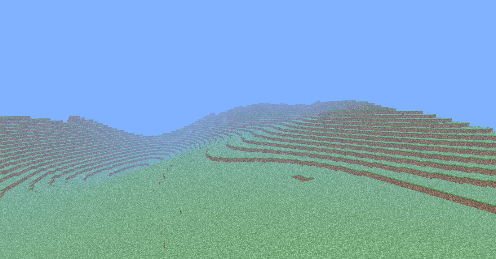
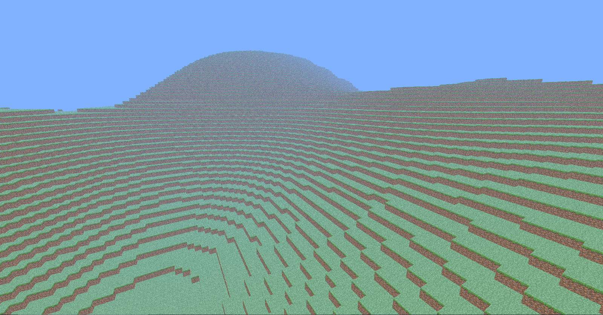
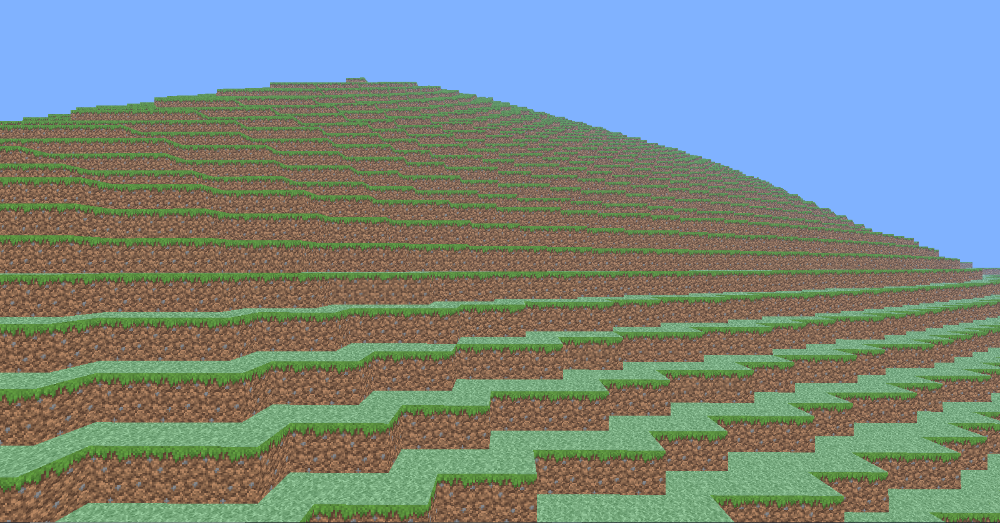
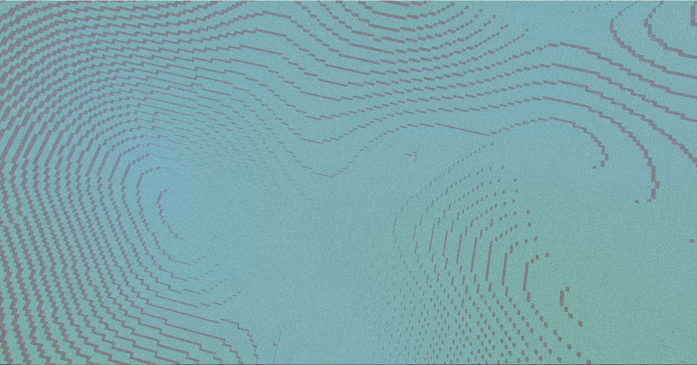

# 
 PyCraft 

#####          
#####    

### 
 A Minecraft clone written in python and pyglet. 

<html lang="en">
<head>
  <meta charset="utf-8">
  <meta name="viewport" content="width=device-width, initial-scale=1">
  <link rel="stylesheet" href="https://maxcdn.bootstrapcdn.com/bootstrap/3.4.1/css/bootstrap.min.css">
  
  
</head>
<body>

  

    <!-- Indicators -->
    <ol class="carousel-indicators">
      <li data-target="#myCarousel" data-slide-to="0" class="active"></li>
      <li data-target="#myCarousel" data-slide-to="1"></li>
      <li data-target="#myCarousel" data-slide-to="2"></li>
      <li data-target="#myCarousel" data-slide-to="3"></li>
    </ol>

 

<!-- Left and right controls -->
<a class="left carousel-control" href="#myCarousel" data-slide="prev">

Previous
</a>
<a class="right carousel-control" href="#myCarousel" data-slide="next">

Next
</a>

</body>

## Running PyCraft
##### To run PyCraft, run the following code:
    git clone https://github.com/TheWebCrafters/PyCraft.git
    cd PyCraft
    python __main__.py
    
## Known issues
- [x] - Will be fixed soon.
#####
- [x] 1. The game hangs while generating chunks.
- [x] 2. All contributors don't appear on the README.

## Contributors
##### (Someone please make all-contributors appear here)
