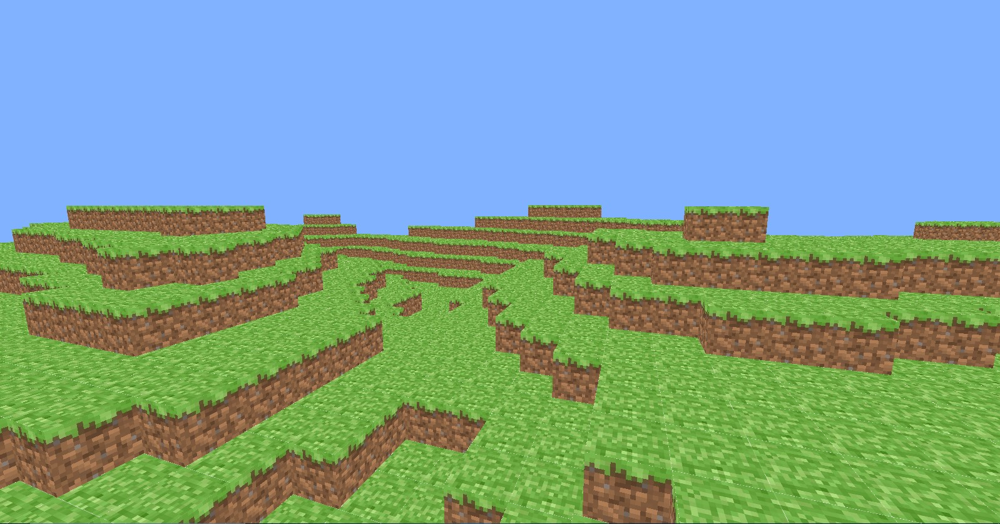

# 
 PyCraft 

#####          
#####    

### 
 A Minecraft clone written in python and pyglet. 

<!-- add style.css -->

<body>

</body>

## Running PyCraft
##### To run PyCraft, run the following code:
    git clone https://github.com/TheWebCrafters/PyCraft.git
    cd PyCraft
    python __main__.py
    
## Known issues
- [x] - Will be fixed soon.
#####
- [x] 1. The game hangs while generating chunks.
- [x] 2. All contributors don't appear on the README.

## Contributors
##### (Someone please make all-contributors appear here)
