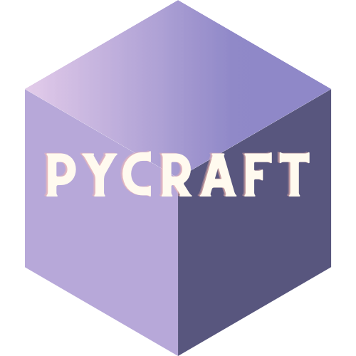

#####          
#####    

### 
 A Minecraft clone written in python and pyglet. 

## Running PyCraft
##### To run PyCraft, run the following code:
##### A dep installer will be added soon.
    git clone https://github.com/1upCommunity/PyCraft.git
    cd PyCraft
    python __main__.py
    
## Known issues
- [x] - Will be fixed soon.
#####
- [x] 1. All contributors don't appear on the README.
- [x] 2. The README doesn't show the carousel.
