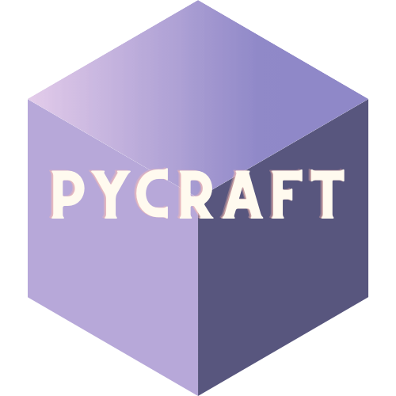

#### 🚧🚧🚧🚧🚧🚧🚧🚧🚧🚧🚧🚧🚧🚧🚧🚧🚧🚧🚧🚧🚧🚧🚧
#### This game is undergoing a major remake and will be 'unplayable' for some time.
#### 🚧🚧🚧🚧🚧🚧🚧🚧🚧🚧🚧🚧🚧🚧🚧🚧🚧🚧🚧🚧🚧🚧🚧
#####            
#####    

### 
 A Minecraft clone written in python. 

## Controls
    Move Forward  : W
    Move Left     : A
    Move Backward : S
    Move Right    : D
    Lock mouse    : E
    Jump          : Space
    Sprint        : Ctrl
    Crouch        : Shift
    Break Block   : Left Click
    Place Block   : Right Click
    Change Block  : Scroll

## Running PyCraft
##### To run PyCraft, run the following code:
    git clone https://github.com/SubNerd/PyCraft.git
    cd PyCraft
    python launch.py
##### (assuming that you already have git and python installed)

## Known issues
- Please let us know if you find any.
